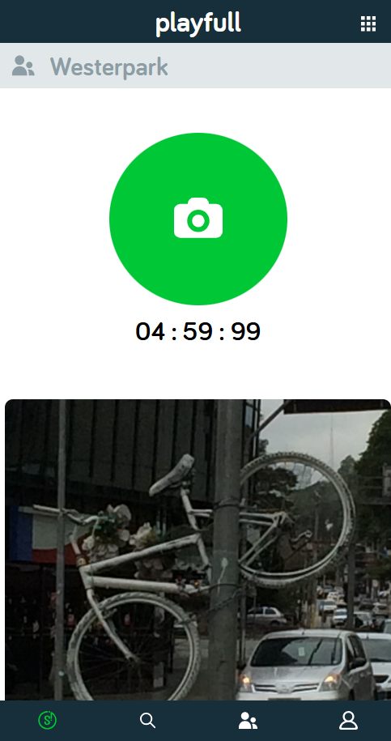

# SnappThis

## Intro  
SnappThis is een webapplicatie waarmee je samen met anderen foto’s kunt verzamelen rond een thema en deze terugziet in een visuele map(snappmap).  
De opdracht was om een gebruiksvriendelijke en leuke website te ontwerpen waarmee groepen makkelijk foto’s kunnen delen en bekijken.  

👉 Live versie: [https://thomasseisveld.github.io/all-human-accessible-website/]

---

## Beschrijving  
Met SnappThis kun je:
- een groep aanmaken en anderen uitnodigen  
- een onderwerp of opdracht starten  
- foto’s uploaden en bekijken van iedereen in de groep  
- alles terugzien in een overzichtelijke snappmap  

De focus ligt op eenvoud, samenwerking en een fijne gebruikerservaring.  

## Kenmerken  
- Gemaakt met **HTML** en **CSS**  
- Backend met **JAVASCRIPT 
- **FIREBASE**  voor het opslaan van gebruikers en foto’s  
- Responsief design (werkt goed op mobiel en desktop)  

## Bronnen  
- [Design Challenge](https://github.com/fdnd-agency/snappthis/wiki/Design-Challenge)  
- Eigen onderzoek en schetsen  

